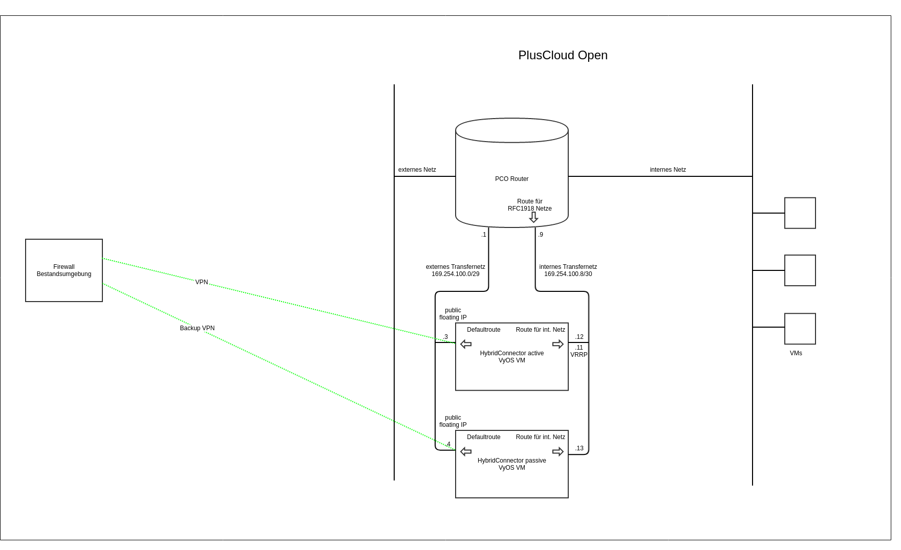

## Übersicht

Der HybridConnector dient dazu IPSec site-to-site VPN Verbindungen in die PlusCloud Open zu ermöglichen. Mit OpenStack Bordmitteln ist das noch nicht möglich.

## Bereitstellung

Der **HybridConnector** (HC) wird in Form zweier redundanzer virtueller Maschinen (VMs) mit mit dem Betriebssystem VyOS bereitgestellt. Die Bereitstellung erfolgt in Ihrem PlusCloud Open Projekt.

Diese VMs erhalten die erforderlichen CPU-, Speicher-, Festplatten- und Netzwerkressourcen. Nach der Bereitstellung werden der **HC** mit grundlegenden Einstellungen wie IP-Adressen, Hostname und administrativen Anmeldeinformationen konfiguriert.

Es werden ein internes und ein externes Transfer-Netz angelegt, die den **HC** mit dem PCO-Router in Ihrem Projekt verbinden.

Überwachungs- und Verwaltungstools werden integriert, um die Funktion des **HCs** zu überwachen.

## Netzwerkdiagram

## Grundlegende Funktionen des HybridConnectors

### VPN-Konnektivität

Es wird eine standardisierte, redundante VPN Verbindung angelegt, die Ihr PCO Projekt mit einer externen Fortigate Firewall verbindet.

### Redundanz

Auf dem internen Transfernetz sprechen die HC VMs VRRP. Die VRRP IP dient dem PCO Router als Gateway für die über das VPN zu erreichenden Netze. Jede der beiden HC VMs hat eine Floating IP auf der die VPNs terminieren. Das VPN auf der primären VM wird mittes BFD überwacht. Im Fehlerfall wird über ein Script das VRRP in "State FAULT" versetzt, so dass die zweite VM übernimmt.

### Limitierungen

- Die Konfiguration geht von einer Fortigate Firewall als VPN Gegenstelle aus.
- Es ist nur ein (routebased) VPN vorgesehen.
- Die IPSec Parameter sind fest vorgegeben.
