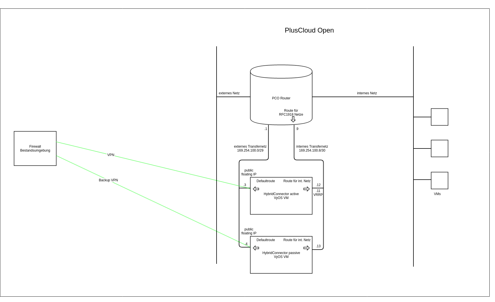

## Intro

The HybridConnector provides an IPSec site-to-site VPN connections into the PlusCloud Open. OpenStack does't support this out of the box yet.

## Deployment

The **HybridConnector** (HC) consists of two redundant virtual machines (VMs) running the operating system VyOS. The provisioning takes place in your PlusCloud Open project.

These VMs get the required CPU-, memory-, harddisk- and network ressources. Next to the deployment, the **HC** is configured with the basic settings like IP
addresses, hostname and administrative logins.

An internal and an external transfer net is deployed, that connect the **HC** to the PCO router in your project.

The **HC** is integrated into monitoring- and management tools, to monitor it's function.

## Network diagram

## Basic funktions of the HybridConnector

### VPN connectivity

A standardized, redundant VPN connection is provided, that connects your PCO Project to an external Fortigate firewall.

### Redundancy

On the internal transfer network the HC VMs speak VRRP. The VRRP IP is the gateway IP, that allows the PCO Router to reach the external networks behind the VPN.
Each of the both HC VMs has a floating IP, that acts as the VPN endpoint. The VPN on the primary VM is monitored by BFD. In case of an error, a script sets the VRRP into "State FAULT", so that the second VM takes over.

### Limitations

- The configuration requires a Fortigate Firewall as the VPN neighbor.
- Only one (routebased) VPN is supported.
- The IPSec parameters are inherent.
